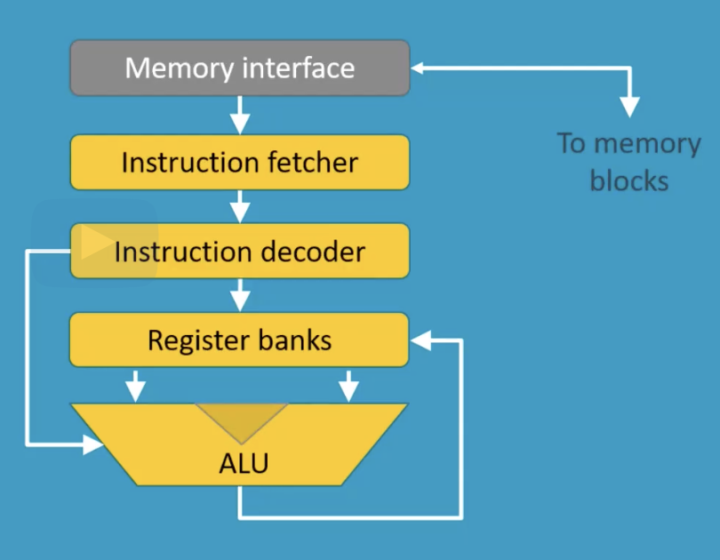
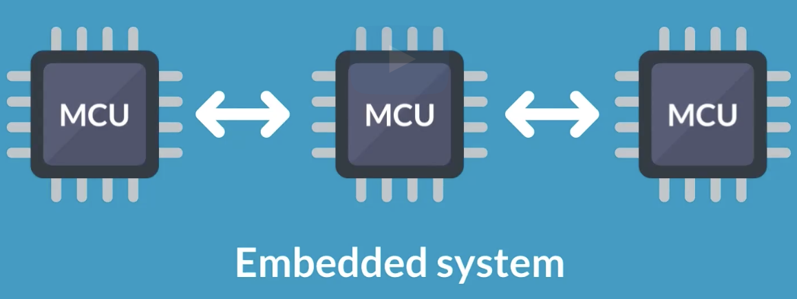

# Module 1

---

## Differences between CPU, MCU and an Embedded System

### CPU (Central Processing Unit)

The microprocessor, also known as a central processing unit or CPU, is the central core of an embedded system. It is a multipurpose, clock driven, programmable electronic device designed to perform arithmetic and logic operations using an arithmetic logic unit, or ALU. It usually performs the instruction cycle of fetching, decoding and executing.

The microprocessor also communicates with other external components with a memory unit via a 
memory interface, and can perform I/O operations based on specific instructions. 

### MCU

A microcontroller unit or MCU consists of a microprocessor plus additional peripheral components such as memory blocks, digital I/Os, analog I/Os, timers, and other basic peripherals. 

The microprocessor is usually a single-core CPU to optimize power and cost efficiency. On-chip memory components such as random-access memory and read-only memory are also optimized for speed, cost, durability, and energy efficiency.

Additional hardware components can include a variety of input and output components, timers, interrupt structures, external buses, and so on. These are chosen based on the controller’s final purpose. All the components within a microcontroller communicate via an internal system bus. 

### Embedded System

An embedded system usually contains one or more interconnected MCUs.

Most parts of an embedded system are electrical components. However, the mechanical structure or the housing of the sensor may also provide important functionality.

The range of applications for an embedded system are enormous. For example, an embedded system can be used as a closed-loop control system to monitor and process a system state, or adjust an output to maintain a desired set point such as temperature, speed, or direction. An embedded system can take over very specialized functions as part of a larger system, such as fault handling or networking, or it could be used to step through different stages of a program, based on environment 
and system requirements

## Benefits and constraints of Embedded Systems

### Advantages

Microcontroller-based embedded systems have many advantages. For instance, software-based applications are more flexible than pure hardware, and can be adapted more easily to changes in system requirements. This can even translate to better performance and efficiency. 

By partitioning the system into hardware and software components, the total system cost can be minimized. The system will be cheaper to make, operate, and maintain.Microcontroller-based designs can implement more features. Through system optimization, memory and on-chip components redundancy can also be reduced. Finally, microcontroller-based systems are more reliable. Failures can be detected, debugged, and
compensated for.

### Constraints

Cost is very important in high-volume production, especially in today’s competitive markets. It is important to balance manufacturing, design, and production costs. Device size and weight can be a constraint, especially for portable and wearable systems. Battery capacity is another constraint, which in turn impacts the power consumption profile affordable to embedded devices.

Finally, designers must consider the effects of any heating issues that may arise due to a system’s operation or the external environment.
These constraints have various impacts on microcontroller-based embedded systems, which make operation and interfacing more difficult.

Programming is mostly done in C or Assembly language due to inherent code efficiency and low programming overhead. These languages also allow control of the required clock cycles per operation more easily. Operating systems are less common for embedded systems, although this is changing in the Internet of Things era. Arm Mbed OS is one example. OSs can simplify development, but the real-time operating system overhead extends code size and reduces transparency around what is really happening inside the MCU.

## Introduction to the Internet of Things

The Internet of Things or IoT is a special application of embedded systems. A physical device is equipped with a microcontroller, sensors and communication interface, enabling it to connect with its environment and network with the whole world.

Because virtually any device could have an embedded processor, <mark>IoT</mark> presents many opportunities
for the growth of embedded systems. These can be loosely <mark>grouped into 3 main areas: industrial, consumer, and wearable.</mark>

The IoT is driven by vast technical development in embedded chips. With smaller packages of embedded systems and more efficient production, prices can drop, allowing the number of applications and systems to increase.

The number of IoT devices has already surpassed the human population, and huge growth is predicted for the future: according to various researchers, by 2030 the total number of connected devices may reach more than 125 billion. <mark>Arm estimates that by 2035, the total number of connected devices will reach 1 trillion.</mark>

## Arm architecture and processors

The Arm architecture is a family of RISC-based processor architectures, well known for its power efficiency and used in many mobile devices. The architecture details a set of instructions that define how the hardware should work upon execution of certain instructions. Arm architecture is suited for use in an array of IoT applications and includes features that meet the
ever-evolving demands for new functionality, integrated security features, high performance and the
needs of new and emerging markets

Although Arm processors are widely considered an industry standard, Arm itself does not manufacture them. Instead, Arm designs the processor cores in its hardware libraries, licenses the designs to producers, and provides an ecosystem of development tools and manuals.

Arm’s processor technology is designed and optimized with the needs and constraints of IoT devices in mind, and so are more energy efficient. Arm processors cover IoT applications from sensors to servers.

|Cortex-A|Cortex-R|Cortex-M|
|---|---|---|
|Arm Cortex-A Processors are application processors used for feature-heavy operating systems and third-party applications. For example, machine learning at the edge, autonomous context-based decision making, or securely connecting IoT devices to the cloud.| Arm Cortex-R Processors are embedded processors for real-time signal processing and control applications. They meet the need for high performance, very low latency, and low power in devices such as connected cars, high-end cameras, or disk drive controllers.|Arm Cortex-M Processors are microcontroller-oriented processors. They can be application-specific, or suitable for system-on-chip uses. They are optimized for low energy consumption and small executables, requiring less physical space and silicon for a lower cost.|

The Arm Cortex-M0 and Cortex-M0+ are designed for applications that require minimal cost, power, and area. These processors are optimized for simple sensing and controlling. The Cortex-M3, Cortex-M4 and Cortex-M7 are designed for data-intense operations with Harvard architecture, dedicated fast hardware multipliers, and math packages. The Cortex-M4 and Cortex-M7 integrate Digital Signal Processing and accelerated floating point processing capability for fast and power-efficient algorithm processing of digital signal control applications.
